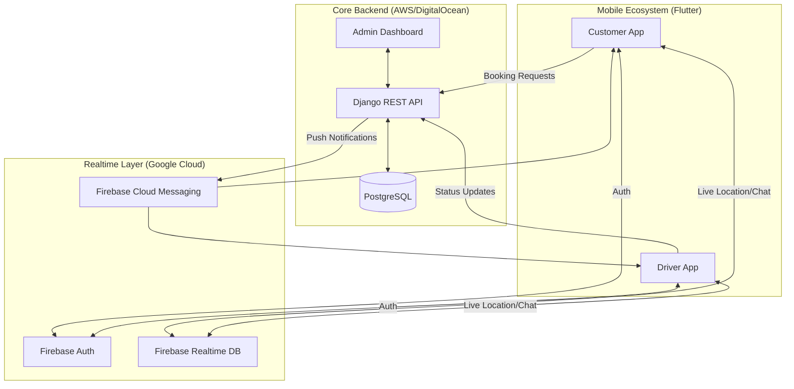

# SwiftRun Ecosystem: Comprehensive Technical Overview

**Date:** January 22, 2026
**Confidentiality:** Internal Use Only
**Project:** SwiftRun Logistics Platform

---

## 1. Executive Summary

SwiftRun is a next-generation logistics platform designed to optimize the last-mile delivery experience. By orchestrating a seamless interaction between customers, drivers, and operations teams, SwiftRun reduces friction in urban logistics. The ecosystem is composed of three synchronized applications:

1.  **SwiftRun Customer (Mobile App)**: The demand generation engine, allowing users to book, track, and pay for deliveries.
2.  **SwiftRun Driver (Mobile App)**: The fulfillment engine, empowering drivers to accept jobs, navigate, and earn.
3.  **SwiftRun Admin (Web Portal)**: The command center, providing centralized control over users, finances, and system configuration.

---

## 2. Architectural Strategy & Justification

The SwiftRun platform employs a **Hybrid Cloud Architecture**, leveraging the strengths of distinct technologies to achieve scalability, real-time performance, and operational security.

### 2.1 Core Technologies

| Component | Technology Information | Strategic Justification (Why this was chosen) |
| :--- | :--- | :--- |
| **Mobile Framework** | **Flutter (Dart)** | **Single Codebase Efficiency:** Flutter allows us to deploy to both iOS and Android from a single codebase, reducing development time by ~40%. Its high-performance rendering engine (Skia) ensures 60fps animations, crucial for a premium map-based experience. |
| **Backend Core** | **Django (Python)** | **Robustness & Security:** Python is the industry standard for data-heavy backends. Django provides "batteries-included" security (preventing SQL injection, XSS) and an auto-generated admin interface that accelerated our Admin Portal development. |
| **Real-time Engine** | **Firebase** | **Low-Latency Sync:** Managing live driver locations requires sub-second latency. Firebase Realtime Database pushes updates instantly to connected clients without complex WebSocket infrastructure, ensuring customers see drivers move in real-time. |
| **Database** | **PostgreSQL** | **Data Integrity:** For financial transactions, order history, and user profiles, ACID compliance is non-negotiable. Relational structure ensures data consistency across the complex logistics web. |
| **Payments** | **Paystack** | **Regional Reliability:** Selected for its high success rates in our target market and seamless mobile SDK integration. |

### 2.2 System Topology

---

## 3. Detailed Component Analysis

### 3.1 Customer Application (`vlogx`)
*Target User: Individuals and businesses needing instant delivery.*

**Key Modules:**
*   **Onboarding & Identity:** Phone number verification ensures legitimate users.
*   **Geospatial Booking Engine:**
    *   *Mechanism:* Uses Google Maps API to calculate precise polyline routes, estimated time of arrival (ETA), and dynamic pricing based on distance (km).
    *   *User Value:* Transparent pricing before booking.
*   **Live Tracking Interface:**
    *   *Tech:* Subscribes to a Firebase stream of the assigned driver’s coordinates.
    *   *Visual:* Updates user map marker with smooth animation interpolation.
*   **Secure Payments:**
    *   *Flow:* User selects card/wallet -> Paystack SDK processes token -> Backend verifies transaction signature -> Booking confirmed.

### 3.2 Driver Application (`vlogx_driver`)
*Target User: Verified independent contractors or fleet drivers.*

**Key Modules:**
*   **Availability State Machine:**
    *   *States:* Offline -> Online (Idle) -> Assigned -> En Route -> Arrived at Pickup -> Goods in Transit -> Delivered.
    *   *Logic:* Only "Online (Idle)" drivers receive new job pings.
*   **Order Broadcast System:**
    *   *Algorithm:* Geo-fenced radius search. When a user requests a ride, the backend queries drivers within X km and sends a notification.
*   **Earnings & Wallet:**
    *   *Transparency:* Drivers see exact payout per trip immediately after completion. Daily/Weekly aggregations help them track goals.

### 3.3 Admin Portal (`vlogxadmin`)
*Target User: Operations Managers, Dispatchers, Accountants.*

**Key Modules:**
*   **Driver Vetting Pipeline:**
    *   *Workflow:* Driver Uploads Docs -> Admin Review (Pending) -> Admin Approve/Reject -> Driver Activated. Includes vehicle inspection logs.
*   **Financial Reconciliation:**
    *   *Features:* Automated calculation of platform commission vs. driver payout. Exportable CSV reports for auditing.
*   **Content Management (CMS):**
    *   *Control:* Ability to update FAQs, Terms of Service, and Vehicle Pricing tiers dynamically without releasing app updates.

---

## 4. Critical Operational Flows

### 4.1 The "Happy Path" Booking Flow
1.  **Request:** Customer sets Pickup/Dropoff. App calculates price. Customer confirms.
2.  **Dispatch:** Request sent to Backend. Backend identifies nearest available drivers.
3.  **Offer:** Notification sent to Driver A. Driver A is busy/ignores. Notification sent to Driver B.
4.  **Acceptance:** Driver B accepts. Backend updates Order Status to `ACCEPTED`.
5.  **Connection:** Customer App receives update. Opens WebSocket channel to Driver B's location.
6.  **Handshake:** Driver arrives. Verifies package. Slides "Start Trip".
7.  **Transit:** Real-time tracking active.
8.  **Completion:** Driver arrives at dest. Slides "Complete".
9.  **Settlement:** Payment processed. Rating screen shown to Customer.

### 4.2 Security & Compliance Flow
*   **Data Privacy:** User phone numbers are masked or strictly controlled.
*   **Traceability:** Every status change is timestamped and logged in PostgreSQL audit tables for dispute resolution.
*   **Gatekeeping:** API endpoints are protected by Token Authentication; only requests with valid headers from the official apps are processed.

---

## 5. Future Scalability Roadmap
*   **AI Dispatching:** Replacing radius search with machine learning models that predict demand and pre-position drivers.
*   **Batching:** allowing drivers to pick up multiple packages along a similar route to increase efficiency.
